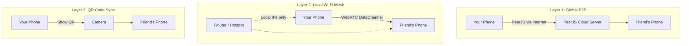
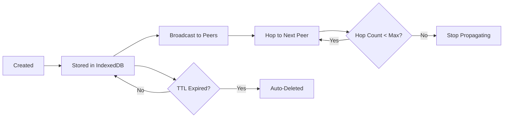

<div align="center">

# 🕸️ WhisperNet

**A peer-to-peer mesh network that works without the internet.**

Share messages, alerts, and updates with people nearby — even when cell towers are down, Wi-Fi has no internet, or you're completely off-grid.

Built for disasters, protests, remote areas, or anywhere traditional communication fails.

</div>

---

## 📖 What is WhisperNet?

WhisperNet is a **decentralized messaging app** that creates a local mesh network between devices. Instead of relying on a central server (like WhatsApp or Telegram), messages hop directly between phones using **peer-to-peer (P2P) connections**.

Think of it like a digital walkie-talkie network — but smarter. Messages automatically spread across the mesh, reaching people several hops away even if you're not directly connected to them.

### The Big Idea

```
Traditional messaging:
  You → Server → Friend
  (If server dies, communication dies)

WhisperNet:
  You → Friend₁ → Friend₂ → Friend₃
  (No server needed. Messages hop through the mesh.)
```

---

## ✨ Features

| Feature | Description |
|---|---|
| 🌐 **Global P2P Mesh** | Connect to anyone worldwide via a 6-character Peer ID using PeerJS |
| 📡 **Offline Wi-Fi Mesh** | Connect nearby devices over local Wi-Fi using WebRTC — no internet needed |
| 📷 **QR Code Sync** | Share messages by scanning QR codes — works completely offline |
| 🔒 **Stealth Mode** | App disguises itself as a weather app; unlock with a secret PIN |
| 💬 **Message Types** | 🚨 Alerts, 📰 News, 🗺️ Routes, 📦 Resources — each with TTL (auto-expiry) |
| 🔄 **Auto-Reconnect** | Background engine automatically redials lost peers every 5 seconds |
| 🖨️ **Static QR Export** | Generate a single printable QR code for wall posters or flyers |
| 📱 **PWA Support** | Install on your phone's home screen like a native app |

---

## 🏗️ How It Works

WhisperNet has **three independent communication layers**. If one fails, the others keep working.

### Layer Architecture



### Layer 1: Global P2P (Internet Required)

This is the easiest way to connect. Both devices need internet access.

```
Step 1: Open WhisperNet → You get a 6-character ID (e.g., "A7X9K2")
Step 2: Share your ID with a friend (text, call, shout it across the room)
Step 3: They enter your ID and tap "Connect"
Step 4: A direct WebRTC tunnel is established via PeerJS signaling
Step 5: Messages flow directly between your phones (P2P, not through a server)
```

**How PeerJS works under the hood:**
- PeerJS is a signaling service that helps two devices find each other on the internet
- Once connected, it upgrades to a **WebRTC DataChannel** — a direct, encrypted tunnel
- The PeerJS server is only used for the initial handshake, NOT for relaying messages
- All actual data flows directly between the two devices

### Layer 2: Local Wi-Fi Mesh (No Internet Needed)

If the internet goes down but you're still on the same Wi-Fi network, this layer takes over.

```
Step 1: Both phones connect to the same Wi-Fi router (router doesn't need internet)
Step 2: Tap "Connect Nearby" → Choose "Show My Code" or "Scan Friend's Code"
Step 3: Phone A shows an animated QR sequence containing a WebRTC SDP Offer
Step 4: Phone B scans it → Generates an SDP Answer → Shows its own QR
Step 5: Phone A scans Phone B's QR → WebRTC tunnel established over local Wi-Fi
Step 6: Messages flow over your local network (192.168.x.x addresses)
```

**Why this works without internet:**
- WebRTC can connect using local IP addresses (your Wi-Fi IP)
- The QR codes carry compressed SDP (Session Description Protocol) data
- SDP contains your device's local IP and port information
- No STUN/TURN servers are needed — candidates are gathered locally

### Layer 3: QR Code Sync (Completely Offline)

Even without Wi-Fi, you can transfer messages by pointing cameras at each other.

```
Step 1: Go to Share → Send tab
Step 2: Choose how many messages to share (Latest 5, Latest 10, or All)
Step 3: Your messages are compressed with LZ-String and split into QR chunks
Step 4: An animated QR sequence flashes on your screen (one chunk per frame)
Step 5: The other person opens Share → Receive and scans the animation
Step 6: Their phone reassembles the chunks and imports the messages
```

**The chunking system:**
- A single QR code can hold ~4000 characters
- A bundle of 50 messages might be 10,000+ characters even after compression
- WhisperNet splits the payload into 200-character chunks
- Each chunk is prefixed: `[1/8]data...`, `[2/8]data...`, etc.
- The QR flashes through all chunks at 600ms intervals
- The scanner accumulates chunks and reassembles when all are received

---

## 🔒 Stealth Mode

WhisperNet disguises itself as a **weather app**. When someone opens it, they see:

```
┌─────────────────────────┐
│    🔍 Search for a city │
│                         │
│     ☀️  Mawlynnong      │
│     Partly Cloudy       │
│        24°              │
│                         │
│  💨 19km/h  💧 45%  🌧 10% │
└─────────────────────────┘
```

To unlock WhisperNet, type your **PIN** into the "Search for a city" box.

**First-time users** see a setup screen where they create their own PIN. The app explains:
> *"This app disguises itself as a weather app. To unlock it later, type your PIN into the search bar."*

---

## 🔄 Message Lifecycle

Every message in WhisperNet has a lifecycle:



### Message Properties

| Property | What it means |
|---|---|
| `type` | 🚨 alert, 📰 news, 🗺️ route, 📦 resource |
| `hopCount` | How many times this message has been relayed |
| `maxHopCount` | Maximum hops allowed (default: 10) |
| `expiresAt` | When this message auto-deletes (TTL) |
| `createdAt` | Timestamp for ordering |

### Deduplication

When a message arrives, WhisperNet checks its `id` against the local database. If it already exists, it's silently dropped. This prevents **packet storms** where the same message bounces around the mesh forever.

---

## 🔐 Security & Privacy

### What's Protected

| Layer | Protection | Details |
|---|---|---|
| **WebRTC Data Channels** | ✅ **Encrypted by default** | All WebRTC DataChannels use DTLS (Datagram Transport Layer Security). This is built into the WebRTC spec — you can't turn it off even if you tried. Every message between peers is encrypted in transit. |
| **Local Storage** | ✅ **Sandboxed** | Messages are stored in IndexedDB, which is sandboxed per-origin by the browser. No other website or app can read WhisperNet's data. |
| **Stealth Mode** | ✅ **Plausible deniability** | The app looks like a weather app. Someone glancing at your phone sees weather data, not a mesh network. The PIN is entered via a fake "search for a city" bar. |
| **TTL Auto-Delete** | ✅ **Forward security** | Messages auto-delete after their TTL expires (1h, 12h, or 24h). Even if someone gains access to your phone later, expired messages are already gone. |
| **No Accounts** | ✅ **Anonymous** | No email, phone number, or login required. Your identity is a random 6-character Peer ID that changes every session. |

### What's NOT Protected (Be Aware)

| Risk | Details |
|---|---|
| **PeerJS signaling server** | The initial handshake for Global P2P goes through PeerJS's cloud server. PeerJS can see that two Peer IDs are connecting (metadata), but **cannot read the actual messages** (those go over encrypted WebRTC). |
| **No end-to-end encryption at the app level** | While WebRTC encrypts data in transit between direct peers, messages that **hop** through intermediate nodes are decrypted and re-encrypted at each hop. A malicious relay node could read messages passing through it. |
| **Message authenticity** | Messages don't have digital signatures. A relay node could theoretically modify a message before forwarding it. There's no way to verify that a message hasn't been tampered with. |
| **PIN stored in plaintext** | The unlock PIN is stored in `localStorage` as plaintext. It's a UI-level lock, not a cryptographic one. If someone has developer tools access, they can read it. |
| **QR codes are unencrypted** | When you show a QR code, anyone who scans it can read the messages. Only show QR codes to people you trust. |

### Security Model Summary

```
┌─────────────────────────────────────────────────┐
│              WhisperNet Security Model           │
├─────────────────────────────────────────────────┤
│                                                  │
│   SAFE from:                                     │
│   ✓ Network eavesdroppers (DTLS encryption)      │
│   ✓ Other apps reading your data (sandboxing)    │
│   ✓ Casual phone inspection (stealth mode)       │
│   ✓ Stale data exposure (TTL auto-delete)        │
│   ✓ Identity tracking (no accounts, random IDs)  │
│                                                  │
│   NOT SAFE from:                                 │
│   ✗ Malicious relay nodes (can read hop data)    │
│   ✗ Physical device access (plaintext PIN)       │
│   ✗ Targeted forensics (IndexedDB is readable)   │
│   ✗ QR shoulder surfing (codes are unencrypted)  │
│                                                  │
│   BOTTOM LINE:                                   │
│   Good enough for disaster relief, coordination, │
│   and casual private messaging. Not designed for  │
│   military-grade or journalist-level security.    │
│   For that, you'd need E2E encryption + message   │
│   signing (a future enhancement).                 │
│                                                  │
└─────────────────────────────────────────────────┘
```

### Future Security Enhancements (Roadmap)

- **End-to-end encryption** — Encrypt messages with recipient's public key so relay nodes can't read them
- **Message signing** — Attach a digital signature so recipients can verify the sender and detect tampering
- **Encrypted local storage** — Encrypt IndexedDB with a key derived from the user's PIN
- **PIN hashing** — Store a bcrypt/argon2 hash instead of the plaintext PIN

---

## 🛠️ Tech Stack

| Technology | Purpose |
|---|---|
| **React 19** | UI framework |
| **TypeScript 6** | Type safety |
| **Vite 8** | Build tool and dev server |
| **Tailwind CSS 4** | Styling |
| **PeerJS** | Internet-based P2P signaling and WebRTC handshake |
| **WebRTC (Native)** | Direct peer-to-peer data channels (both internet and local Wi-Fi) |
| **Dexie.js** | IndexedDB wrapper for local message storage |
| **Zustand** | Lightweight global state management |
| **fflate** | High-performance compression for SDP blobs |
| **LZ-String** | Compression for QR code payloads |
| **qrcode** | QR code generation |
| **html5-qrcode** | Camera-based QR code scanning |
| **Sonner** | Toast notifications |
| **Lucide React** | Icon library |
| **React Router** | Client-side navigation |

---

## 📁 Project Structure

```
src/
├── app/
│   └── App.tsx              # Root component, security gate, routing
├── components/
│   ├── AnimatedQR.tsx       # Animated multi-frame QR display
│   ├── BottomNav.tsx        # Bottom navigation bar
│   ├── OfflineHandshake.tsx # QR-based WebRTC handshake modal
│   └── Scanner.tsx          # Camera QR scanner with chunk accumulation
├── db/
│   ├── db.ts                # Dexie IndexedDB schema
│   └── messages.ts          # CRUD operations for messages
├── pages/
│   ├── Alert.tsx            # "New Message" — create and broadcast
│   ├── Decoy.tsx            # Fake weather app (stealth lock screen)
│   ├── Feed.tsx             # Main message feed with category filters
│   ├── QRGen.tsx            # QR generation (animated + static)
│   ├── QRRead.tsx           # QR scanning and import
│   ├── Scan.tsx             # Share tab (Send/Receive)
│   ├── Settings.tsx         # Device settings and dev tools
│   └── Setup.tsx            # First-time PIN creation
├── qr/
│   ├── exportBundle.ts      # Serialize messages → compressed string
│   ├── importBundle.ts      # Compressed string → messages
│   └── schema.ts            # QR bundle type definitions
├── store/
│   └── index.ts             # Zustand stores (UI, Security, Network, Messages)
├── sync/
│   ├── mesh.ts              # PeerJS mesh networking engine
│   ├── offlineMesh.ts       # WebRTC local Wi-Fi tunneling
│   ├── messageEngine.ts     # Message processing pipeline
│   ├── conflict.ts          # Version conflict resolution
│   └── ttl.ts               # Time-to-live cleanup
├── types/
│   └── message.ts           # TypeScript type definitions
└── utils/
    └── qrChunker.ts         # Split/reassemble payloads for animated QR
```

---

## 🚀 Getting Started

### Prerequisites

- [Bun](https://bun.sh/) (or Node.js 20+)
- A modern browser with WebRTC support (Chrome, Safari, Firefox)

### Installation

```bash
# Clone the repo
git clone https://github.com/Aneeshie/WhisperNet.git
cd WhisperNet

# Install dependencies
bun install

# Start dev server (HTTPS required for camera/WebRTC)
bun dev
```

The app will be available at `https://localhost:5173`.

> **Note:** HTTPS is required because browsers only allow camera access and WebRTC on secure origins.

### Building for Production

```bash
bun run build
```

The output will be in `dist/` — deploy to any static hosting (Vercel, Netlify, GitHub Pages).

---

## 📱 Real-World Scenarios

### 🌪️ Scenario 1: Natural Disaster

*Cell towers are down. Internet is gone. Power is intermittent.*

1. A relief coordinator opens WhisperNet and creates a message: `🚨 Alert: Water distribution at Community Center, 2pm`
2. They show the QR code (Share → Send → Static) and print it on paper
3. People scan the printed QR with their phones to receive the alert
4. Those people walk to another area and show their animated QR to others
5. The message spreads through the community without any internet

### 🏔️ Scenario 2: Remote Hiking Group

*You're in the mountains with no cell signal, but someone has a portable hotspot.*

1. Turn on a portable router (no SIM card needed, just power)
2. Everyone connects their phones to the hotspot's Wi-Fi
3. One person taps "Connect Nearby" → "Show My Code"
4. Others scan it → Local Wi-Fi mesh established
5. Share route updates, alert about trail conditions, coordinate meetup points
6. All messages persist locally even after disconnecting

### ✊ Scenario 3: Protest Communication

*Internet is being throttled or monitored.*

1. The app looks like a weather app — nobody suspects anything
2. Organizers connect via Peer IDs while internet is still available
3. Messages auto-sync between connected peers
4. If internet is cut, the local Wi-Fi mesh keeps communication alive
5. If Wi-Fi is also killed, people physically walk to others and sync via QR codes
6. Messages have TTL — sensitive info auto-deletes after the set time

---

## 🤝 Contributing

Pull requests are welcome! For major changes, please open an issue first to discuss what you'd like to change.

---

## 📄 License

This project is open source. See the [LICENSE](LICENSE) file for details.

---

<div align="center">

**Built with ❤️ for a more resilient world.**

*When the internet goes dark, WhisperNet keeps the conversation alive.*

</div>
