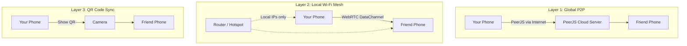
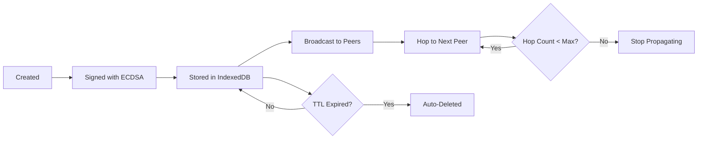
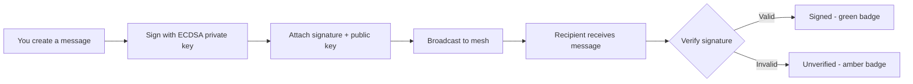

<div align="center">

# WhisperNet

**A peer-to-peer mesh network that works without the internet.**

Share messages, alerts, and updates with people nearby -- even when cell towers are down, Wi-Fi has no internet, or you are completely off-grid.

Built for disasters, protests, remote areas, or anywhere traditional communication fails.

</div>

---

## What is WhisperNet?

WhisperNet is a **decentralized messaging app** that creates a local mesh network between devices. Instead of relying on a central server (like WhatsApp or Telegram), messages hop directly between phones using **peer-to-peer (P2P) connections**.

Think of it like a digital walkie-talkie network -- but smarter. Messages automatically spread across the mesh, reaching people several hops away even if you are not directly connected to them.

### The Big Idea

```
Traditional messaging:
  You --> Server --> Friend
  (If server dies, communication dies)

WhisperNet:
  You --> Friend1 --> Friend2 --> Friend3
  (No server needed. Messages hop through the mesh.)
```

---

## Features

| Feature | Description |
|---|---|
| **Global P2P Mesh** | Connect to anyone worldwide via a 6-character Peer ID using PeerJS |
| **Offline Wi-Fi Mesh** | Connect nearby devices over local Wi-Fi using WebRTC -- no internet needed |
| **QR Code Sync** | Share messages by scanning QR codes -- works completely offline |
| **Stealth Mode** | App disguises itself as a weather app; unlock with a secret PIN |
| **Message Types** | Alerts, News, Routes, Resources -- each with TTL (auto-expiry) |
| **Message Signing** | Every message is cryptographically signed with ECDSA P-256 |
| **Auto-Reconnect** | Background engine automatically redials lost peers every 5 seconds |
| **Static QR Export** | Generate a single printable QR code for wall posters or flyers |
| **PWA Support** | Install on your phone home screen like a native app |

---

## How It Works

WhisperNet has **three independent communication layers**. If one fails, the others keep working.

### Layer Architecture



### Layer 1: Global P2P (Internet Required)

This is the easiest way to connect. Both devices need internet access.

```
Step 1: Open WhisperNet --> You get a 6-character ID (e.g., "A7X9K2")
Step 2: Share your ID with a friend (text, call, shout it across the room)
Step 3: They enter your ID and tap "Connect"
Step 4: A direct WebRTC tunnel is established via PeerJS signaling
Step 5: Messages flow directly between your phones (P2P, not through a server)
```

**How PeerJS works under the hood:**
- PeerJS is a signaling service that helps two devices find each other on the internet
- Once connected, it upgrades to a **WebRTC DataChannel** -- a direct, encrypted tunnel
- The PeerJS server is only used for the initial handshake, NOT for relaying messages
- All actual data flows directly between the two devices

### Layer 2: Local Wi-Fi Mesh (No Internet Needed)

If the internet goes down but you are still on the same Wi-Fi network, this layer takes over.

```
Step 1: Both phones connect to the same Wi-Fi router (router does not need internet)
Step 2: Tap "Connect Nearby" --> Choose "Show My Code" or "Scan Friend Code"
Step 3: Phone A shows an animated QR sequence containing a WebRTC SDP Offer
Step 4: Phone B scans it --> Generates an SDP Answer --> Shows its own QR
Step 5: Phone A scans Phone B QR --> WebRTC tunnel established over local Wi-Fi
Step 6: Messages flow over your local network (192.168.x.x addresses)
```

**Why this works without internet:**
- WebRTC can connect using local IP addresses (your Wi-Fi IP)
- The QR codes carry compressed SDP (Session Description Protocol) data
- SDP contains your device local IP and port information
- No STUN/TURN servers are needed -- candidates are gathered locally

### Layer 3: QR Code Sync (Completely Offline)

Even without Wi-Fi, you can transfer messages by pointing cameras at each other.

```
Step 1: Go to Share --> Send tab
Step 2: Choose how many messages to share (Latest 5, Latest 10, or All)
Step 3: Your messages are compressed with LZ-String and split into QR chunks
Step 4: An animated QR sequence flashes on your screen (one chunk per frame)
Step 5: The other person opens Share --> Receive and scans the animation
Step 6: Their phone reassembles the chunks and imports the messages
```

**The chunking system:**
- A single QR code can hold ~4000 characters
- A bundle of 50 messages might be 10,000+ characters even after compression
- WhisperNet splits the payload into 200-character chunks
- Each chunk is prefixed: `[1/8]data...`, `[2/8]data...`, etc.
- The QR flashes through all chunks at 600ms intervals
- The scanner accumulates chunks and reassembles when all are received

---

## Stealth Mode

WhisperNet disguises itself as a **weather app**. When someone opens it, they see a weather interface for "Mawlynnong" showing temperature, wind, humidity, and rain data.

To unlock WhisperNet, type your **PIN** into the "Search for a city" box.

**First-time users** see a setup screen where they create their own PIN. The app explains:
> *"This app disguises itself as a weather app. To unlock it later, type your PIN into the search bar."*

---

## Message Lifecycle

Every message in WhisperNet has a lifecycle:



### Message Properties

| Property | What it means |
|---|---|
| `type` | alert, news, route, or resource |
| `hopCount` | How many times this message has been relayed |
| `maxHopCount` | Maximum hops allowed (default: 10) |
| `expiresAt` | When this message auto-deletes (TTL) |
| `createdAt` | Timestamp for ordering |
| `signature` | ECDSA digital signature for tamper detection |
| `senderPublicKey` | Sender public key for verification |

### Deduplication

When a message arrives, WhisperNet checks its `id` against the local database. If it already exists, it is silently dropped. This prevents **packet storms** where the same message bounces around the mesh forever.

---

## Security and Privacy

All cryptography uses the browser built-in **Web Crypto API** -- zero external dependencies.

### Cryptographic Protections (Implemented)

| Layer | Algorithm | What it does |
|---|---|---|
| **PIN Hashing** | PBKDF2 (100k iterations, SHA-256) | Your unlock PIN is never stored as plaintext. Only a salted hash is saved. Even with physical device access, the PIN cannot be read from storage. |
| **Message Signing** | ECDSA P-256 | Every message you send is digitally signed with your device private key. Recipients can verify it has not been tampered with. Tampered messages show a warning badge. |
| **Device Identity** | ECDSA Key Pair | On first setup, a unique ECDSA P-256 key pair is generated. Your public key travels with your messages as proof of authorship. |
| **Encryption Key** | AES-256-GCM (via PBKDF2) | An AES encryption key is derived from your PIN when you unlock. It exists **only in memory** and is wiped when you lock the app. |
| **Transport Encryption** | DTLS (WebRTC) | All WebRTC DataChannels use DTLS encryption. This is mandatory in the WebRTC spec -- every message between peers is encrypted in transit. |
| **Storage Isolation** | Browser Sandboxing | Messages in IndexedDB are sandboxed per-origin. No other website or app can access them. |
| **Stealth Mode** | UI Camouflage | The app disguises itself as a weather app. The PIN is entered via a fake search bar -- plausible deniability. |
| **TTL Auto-Delete** | Time-based | Messages auto-delete after their TTL expires. Even with device access, expired messages are already gone. |

### How Signing Works



### What is NOT Protected (Be Aware)

| Risk | Status | Details |
|---|---|---|
| **PeerJS signaling server** | Mitigated | PeerJS can see metadata (which Peer IDs connect), but cannot read messages. Use the offline Wi-Fi mesh or QR sync to bypass PeerJS entirely. |
| **Relay node visibility** | By design | Broadcast messages (alerts, news) are meant to be readable by all mesh participants. This is intentional for emergency communication. |
| **QR codes** | Fixed | QR bundles are now AES-256-GCM encrypted and HMAC signed. Only someone with the same PIN-derived key can decrypt and verify them. |
| **Private key in localStorage** | Fixed | The ECDSA private key is now AES-256-GCM encrypted at rest using your PIN-derived key. It is only decrypted in memory while the app is unlocked. |
| **Messages in IndexedDB** | Fixed | All message content is AES-256-GCM encrypted before being written to IndexedDB. Plaintext only exists in memory while the app is unlocked. |

### Security Model

```
PROTECTED by:
  + PBKDF2 PIN hashing (100k iterations)
  + ECDSA P-256 message signing and verification
  + AES-256-GCM encrypted message storage (IndexedDB)
  + AES-256-GCM encrypted private key at rest
  + AES-256-GCM encrypted QR bundles with HMAC integrity
  + DTLS transport encryption (WebRTC)
  + Browser sandbox isolation (IndexedDB)
  + Stealth UI camouflage (weather app)
  + TTL auto-deletion (forward security)
  + No accounts (anonymous, random Peer IDs)

REMAINING RISKS (by design):
  - Relay nodes can read broadcast messages (intentional for mesh)
  - PeerJS sees connection metadata (use offline mesh to bypass)
```

### Future Security Enhancements

- **End-to-end encryption** -- Encrypt point-to-point messages with ECDH shared secrets so relay nodes cannot read them
- **Trusted device registry** -- Allow users to whitelist known public keys for enhanced verification

---

## Tech Stack

| Technology | Purpose |
|---|---|
| **React 19** | UI framework |
| **TypeScript 6** | Type safety |
| **Vite 8** | Build tool and dev server |
| **Tailwind CSS 4** | Styling |
| **Web Crypto API** | PBKDF2 PIN hashing, ECDSA signing, AES-256-GCM key derivation |
| **PeerJS** | Internet-based P2P signaling and WebRTC handshake |
| **WebRTC (Native)** | Direct peer-to-peer data channels (both internet and local Wi-Fi) |
| **Dexie.js** | IndexedDB wrapper for local message storage |
| **Zustand** | Lightweight global state management |
| **fflate** | High-performance compression for SDP blobs |
| **LZ-String** | Compression for QR code payloads |
| **qrcode** | QR code generation |
| **html5-qrcode** | Camera-based QR code scanning |
| **Sonner** | Toast notifications |
| **Lucide React** | Icon library |
| **React Router** | Client-side navigation |

---

## Project Structure

```
src/
  app/
    App.tsx              -- Root component, security gate, routing
  components/
    AnimatedQR.tsx       -- Animated multi-frame QR display
    BottomNav.tsx        -- Bottom navigation bar
    OfflineHandshake.tsx -- QR-based WebRTC handshake modal
    Scanner.tsx          -- Camera QR scanner with chunk accumulation
  db/
    db.ts                -- Dexie IndexedDB schema
    messages.ts          -- CRUD operations for messages
  pages/
    Alert.tsx            -- "New Message" create and broadcast
    Decoy.tsx            -- Fake weather app (stealth lock screen)
    Feed.tsx             -- Main message feed with category filters
    QRGen.tsx            -- QR generation (animated + static)
    QRRead.tsx           -- QR scanning and import
    Scan.tsx             -- Share tab (Send/Receive)
    Settings.tsx         -- Device settings and dev tools
    Setup.tsx            -- First-time PIN creation
  privacy/
    crypto.ts            -- PBKDF2, ECDSA, AES-256-GCM (Web Crypto API)
  qr/
    exportBundle.ts      -- Serialize messages to compressed string
    importBundle.ts      -- Compressed string to messages
    schema.ts            -- QR bundle type definitions
  store/
    index.ts             -- Zustand stores (UI, Security, Network, Messages)
  sync/
    mesh.ts              -- PeerJS mesh networking engine
    offlineMesh.ts       -- WebRTC local Wi-Fi tunneling
    messageEngine.ts     -- Message processing pipeline
    conflict.ts          -- Version conflict resolution
    ttl.ts               -- Time-to-live cleanup
  types/
    message.ts           -- TypeScript type definitions
  utils/
    qrChunker.ts         -- Split/reassemble payloads for animated QR
```

---

## Getting Started

### Prerequisites

- [Bun](https://bun.sh/) (or Node.js 20+)
- A modern browser with WebRTC support (Chrome, Safari, Firefox)

### Installation

```bash
# Clone the repo
git clone https://github.com/Aneeshie/WhisperNet.git
cd WhisperNet

# Install dependencies
bun install

# Start dev server (HTTPS required for camera/WebRTC)
bun dev
```

The app will be available at `https://localhost:5173`.

> **Note:** HTTPS is required because browsers only allow camera access and WebRTC on secure origins.

### Building for Production

```bash
bun run build
```

The output will be in `dist/` -- deploy to any static hosting (Vercel, Netlify, GitHub Pages).

---

## Real-World Scenarios

### Scenario 1: Natural Disaster

*Cell towers are down. Internet is gone. Power is intermittent.*

1. A relief coordinator opens WhisperNet and creates a message: "Alert: Water distribution at Community Center, 2pm"
2. They show the QR code (Share, Send, Static) and print it on paper
3. People scan the printed QR with their phones to receive the alert
4. Those people walk to another area and show their animated QR to others
5. The message spreads through the community without any internet

### Scenario 2: Remote Hiking Group

*You are in the mountains with no cell signal, but someone has a portable hotspot.*

1. Turn on a portable router (no SIM card needed, just power)
2. Everyone connects their phones to the hotspot Wi-Fi
3. One person taps "Connect Nearby", then "Show My Code"
4. Others scan it -- Local Wi-Fi mesh established
5. Share route updates, alert about trail conditions, coordinate meetup points
6. All messages persist locally even after disconnecting

### Scenario 3: Protest Communication

*Internet is being throttled or monitored.*

1. The app looks like a weather app -- nobody suspects anything
2. Organizers connect via Peer IDs while internet is still available
3. Messages auto-sync between connected peers
4. If internet is cut, the local Wi-Fi mesh keeps communication alive
5. If Wi-Fi is also killed, people physically walk to others and sync via QR codes
6. Messages have TTL -- sensitive info auto-deletes after the set time
7. All messages are cryptographically signed -- tampering is detectable

---

## Contributing

Pull requests are welcome! For major changes, please open an issue first to discuss what you would like to change.

---

## License

This project is open source. See the [LICENSE](LICENSE) file for details.

---

<div align="center">

**Built for a more resilient world.**

*When the internet goes dark, WhisperNet keeps the conversation alive.*

</div>
